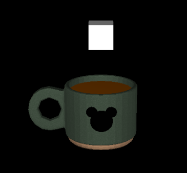

# Coffee Mug: How many sugar cubes do you want?

https://joaodelrio.github.io/Three.js-Animation/

Para a matéria de computação gráfica, foi necessário utilizar o three.js para criar uma animação. A animação escolhida é a queda de cubos de açúcar em uma xícara de café. É possível adicionar os cubos através do menu no canto superior direito.

## Geometrias

- **CylinderGeometry:** Usado para simular o líquido do café dentro da caneca.
- **BoxGeometry:** Usado para simular os cubos de açúcar.
- **CircleGeometry:** Usado para fazer o desenho do Mickey na caneca.

## Materiais

- **MeshLambertMaterial**
- **MeshPhongMaterial**

## Textura e Modelo Externo

- Modelo 3D de uma caneca retirado do site [FreePik](https://www.freepik.com/3d-model/mug-031_7607.htm#&position=43&from_view=search&uuid=18fd323b-4692-4846-8b18-046676189275).

## Fontes de Iluminação

- Duas fontes de iluminação paralelas: uma à esquerda e outra à direita.
